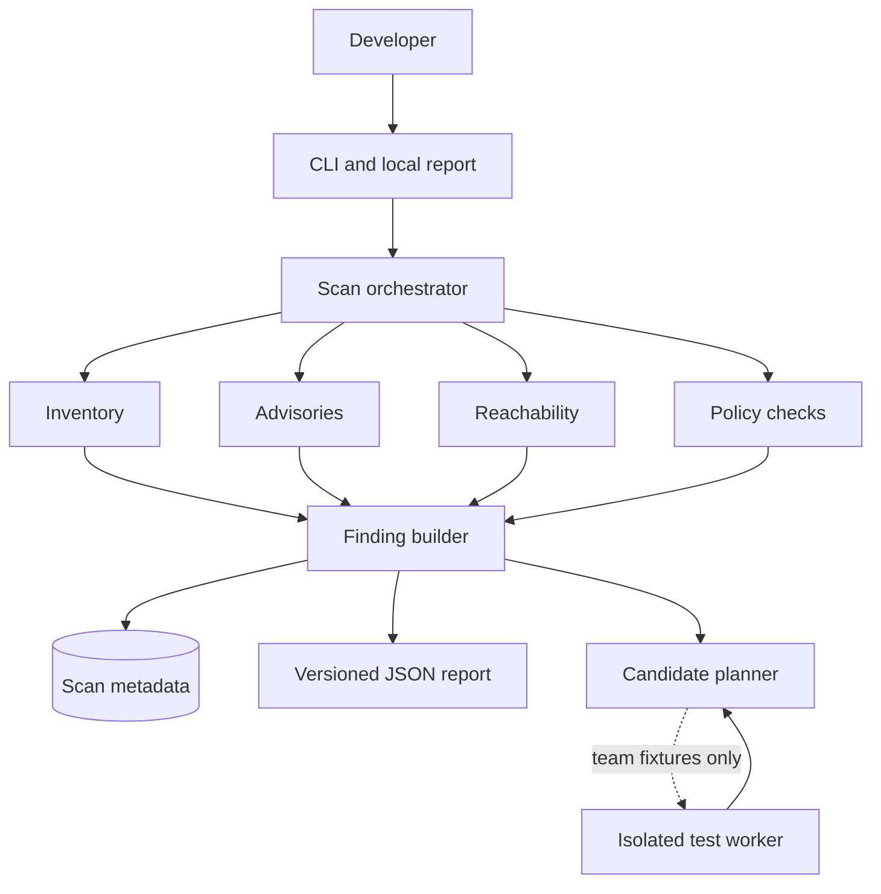

# Architecture

## Context

Dependency Review is a local-first analysis application. Static analysis is read-only. Optional compatibility execution is a separate trust boundary and initially accepts only team-owned fixtures.

## Component responsibilities

### CLI and local report

Collect explicit project root/entry points, start scans, render escaped structured evidence and export reports. Bind the web service to loopback and protect mutation endpoints with a per-session token and origin checks.

### Scan orchestrator

Creates immutable scan identity, applies global resource limits, calls analysers and records partial failures. A failed analyser must not disappear as zero findings.

### Inventory

Parses supported lockfiles without package installation. Produces exact package-instance nodes and dependency edges. Multiple versions remain distinct.

### Advisory client

Uses constrained outbound hosts, bounded/cached responses and timestamped OSV records. Normalises aliases for display while retaining original evidence.

### Reachability

Parses source without loading target configuration. Resolves the supported module subset, tracks lexical bindings and traverses bounded call edges from declared entry points. Emits coverage gaps and one of the four defined reachability states.

### Policy checks

Runs independent outdated, metadata-delta, install-script, licence and concentration rules. Each rule returns evidence, status, version and uncertainty; it does not directly write prose.

### Finding builder

Joins package instance, advisory applicability, reachability and policy evidence. It preserves conflicting or incomplete evidence. It does not produce a single opaque risk score.

### Candidate planner

Generates a bounded set of direct-dependency candidates, resolves each in a disposable copy and compares actual resulting graphs. It does not edit nested lockfiles by assumption or mutate the original project.

### Test worker

Separate process/host boundary with no ambient credentials, host socket or broad mounts. Acquisition and no-network execution are separate phases. Initial policy permits only allowlisted team fixtures.

## Data model

Stable identities:

- Project: canonical root metadata plus content fingerprint.
- Scan: project fingerprint + tool/policy/catalog/config versions + timestamps.
- Package instance: ecosystem + name + version + resolved installation path.
- Advisory evidence: source + source ID + retrieved/modified timestamps + content digest.
- Call edge: source location + binding/resolution method + assumptions.
- Candidate: requested direct changes + resolved graph digest.
- Test result: candidate digest + command ID + environment digest + result.

Reports reference evidence IDs; they do not copy unverifiable prose into authoritative fields.

## Trust boundaries

1. Target repository → static parsers: hostile files and names; no execution.
2. External metadata → clients: hostile responses/redirects; allowlists and limits.
3. Structured evidence → UI/LLM: output encoding and schema validation.
4. Scanner → test worker: hostile code execution boundary.
5. Export → developer: report integrity and stale-state visibility.

## Dependency and call graphs

Never combine them into one ambiguous edge type. The dependency graph explains installation provenance. The call graph explains supported source-flow evidence. Join them only through exact package-instance and symbol mappings.

## Failure behaviour

Every analyser returns `complete`, `partial`, `unsupported` or `failed`, plus reasons. Overall scan completion does not overwrite component status. The UI surfaces missing evidence next to affected conclusions.

## Scalability limits

Limits must be configurable and reported: maximum files, bytes, AST nodes, graph nodes/edges, traversal depth, API response size, planner candidates and time per stage. Hitting a limit returns partial/unknown rather than truncating silently.

## Future boundaries

A second ecosystem uses a new inventory/advisory adapter. Cross-language reachability requires a separate design and fixtures. Remote repository ingestion, production hostile-code execution and organisation accounts are post-hackathon decisions.

