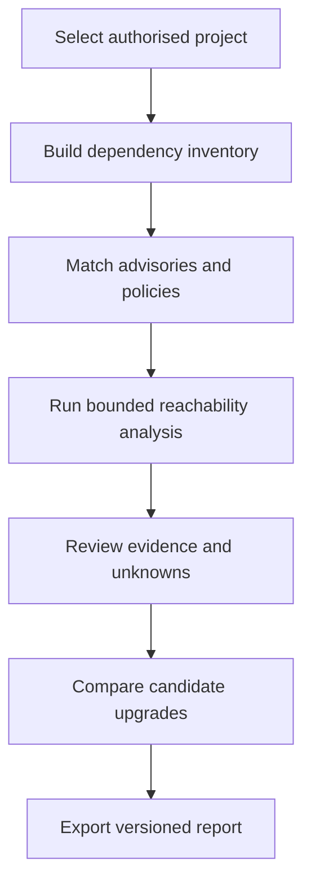

<div align="center">

# 🛡️ Fides

*Latin: **fidēs** — trust, good faith, reliability. Also the Roman personified goddess of trust and honesty in dealings.*

**Evidence-first dependency risk analysis for npm projects.**
*No opaque scores. No guessed call paths. "Unknown" is a valid answer.*


**Cybersecurity PS12 — Software Supply Chain Dependency Risk Analyser**

[Quick start](#-quick-start) · [For judges](#-for-judges) · [How it works](#-how-it-works) · [The report](#-the-report) · [PS12 coverage](#-problem-statement-coverage) · [Docs](#-documentation)

</div>

---

## The pitch

The name is the thesis: **fides** is Latin for trust, good faith, and reliability — the thing a dependency report should earn, not assume. Most scanners hand a developer a wall of CVEs and a single scary score. Fides is built to answer three narrower, more useful questions instead:

1. **Which installed dependencies have known or policy-relevant risks?**
2. **What evidence shows whether the application may actually use the affected code?**
3. **Which candidate dependency change is safest under the checks we actually ran?**

Everything the tool reports is traceable back to a versioned input — a lockfile, a snapshot, a test run — so a judge, a reviewer, or a future you can reproduce the exact same result.

### At a glance

| | |
| --- | --- |
| **Scope** | Local, authorised npm projects · `package-lock.json` v2/v3 · JavaScript source |
| **Language / runtime** | TypeScript (strict) on Node.js ≥ 22.9 |
| **Runtime dependencies** | 2 — `@babel/parser`, `@babel/traverse` (AST parsing only, target code is never executed) |
| **Tests** | 114 cases across 7 validation gates, run with Node's built-in `node:test` |
| **Network** | None required for a scan. Only an optional AI-explanation call needs an API key |

---

## 🎯 For judges

**This is not "just OSV-Scanner."** OSV is one of our evidence sources, not the product. What we're actually demonstrating is a **decision record**: a scan result that shows *why* something is flagged, *whether* the vulnerable code is reachable from your entry points, and *what happens* if you try a specific fix — including when that fix fails a real test.

A few things worth checking first:

- We never claim a call path proves exploitability — only that it's *potentially reachable* under stated static assumptions.
- "No path found in scope" and "unknown" are two different, clearly distinguished outcomes — we don't quietly collapse them into "safe."
- The candidate comparison can and does report **untested / failed / inconclusive**, not just "fixed."
- npm-only is a disclosed limitation, not a hidden one (see [PS12 coverage](#-problem-statement-coverage) below).

The full eight-minute walkthrough, fixture story, and anticipated Q&A live in [`DEMO.md`](DEMO.md).

---

## 🚀 Quick start

**Requirements:** Node.js 22.9+ and npm.

```bash
git clone https://github.com/UdayGoel28/Fides.git
cd Fides
npm install
npm run dev
```

Then open **http://127.0.0.1:3000** and select **Run deterministic scan**.

> ⚠️ Opening `frontend/index.html` directly as a file will **not** work — the page needs the local API server behind it to run the analysis engine.

The deterministic scan needs no API key and no `.env` file. AI-generated plain-language explanations are optional: copy `.env.example` to `.env` and add a Groq API key to enable them. `.env` is git-ignored and never required for the core scan.

| Command | What it does |
| --- | --- |
| `npm run dev` / `npm start` | Start the local server + web report at `:3000` |
| `npm run build` | Typecheck plus syntax checks on the server and browser bundle |
| `npm run typecheck` | `tsc --noEmit` |
| `npm test` | Run all 114 gate tests via `node:test` |

---

## 🧭 How it works



1. **Inventory** — parse `package-lock.json` v2/v3 into an exact instance graph, without running `npm install`.
2. **Advisory matching** — match each package instance against the bundled advisory snapshot (OSV-shaped data).
3. **Reachability** — parse JavaScript source (never executed) from declared entry points to see whether flagged code is actually reachable.
4. **Policy** — evaluate licence, outdated-dependency, install-script/metadata, and maintainer-concentration signals.
5. **Remediation planning** — compare a bounded set of candidate upgrades against the checks actually run, with `untested` as an honest default.
6. **Export** — a complete, versioned JSON audit record behind everything shown in the browser.

A deeper component and trust-boundary diagram lives in [`ARCHITECTURE.md`](ARCHITECTURE.md).

---

## 🖥️ The report

Six views, in the order a developer would actually use them:

| Page | What it shows |
| --- | --- |
| **Scan & Scope** | Run the bundled demo, download a sample lockfile/source, or import your own files — all without installing or executing anything |
| **Summary & Findings** | A high-level view of the exact report currently loaded, filterable without hiding unknown results by default |
| **Finding Deep Dive** | The full evidence chain for one finding: package instance, advisory match, reachability path (or coverage gap), and remaining uncertainty |
| **Candidate Comparison** | Each supplied remediation candidate against advisory applicability, recorded checks, and unresolved uncertainty |
| **Audit Export** | Inspect or download the complete structured JSON report behind the interface |
| **Settings** | Dark/light/system theme, high-contrast mode, findings page size, and report retention — all local to the browser |

---

## 🔍 Example: what the bundled demo fixture is built to show

The included, team-owned `demo-fixture` is designed to exercise several outcomes in one small, reproducible tree — not to simulate a real-world CVE:

| Package | Finding | Demonstrates |
| --- | --- | --- |
| `vulnerable-dep@1.0.0` (direct) | Potential path found | A reviewed advisory mapping with a supported, source-navigable call path |
| `transitive-vuln@3.0.0` (transitive) | No path found in scope | A distinct outcome from "safe" — just nothing found under the analysed bounds |
| `dynamic-dep@1.0.0` (direct) | Unknown | An unsupported dynamic-import pattern, honestly reported instead of guessed |
| `duplicate-dep@1.0.0` / `@2.0.0` | Two distinct instances | Duplicate dependency versions are never collapsed into one |

A companion `demo-fixture-attack` tree exercises a second, adversarial snapshot for the same pipeline. Full reproduction steps and known limits are in [`FINAL_VALIDATION.md`](FINAL_VALIDATION.md).

---

## ✅ Problem-statement coverage

| PS12 requirement | Initial coverage | Completion test |
| --- | --- | --- |
| Dependency tree | npm lockfile instance graph | Independent graph fixture matches |
| Known vulnerabilities | OSV affected-version match | Known affected/fixed cases match |
| Reachability | Reviewed catalog + bounded call paths | Supported / negative / unknown suites pass |
| Outdated & upgrade effort | Version delta, graph churn, evidence-based band | Reasons present; no invented time estimate |
| Suspicious changes | Snapshot delta + install-script signal | No history produces `unknown`, not a false negative |
| Licence conflicts | Declared policy over a documented SPDX subset | AND/OR/WITH fixtures pass or escalate |
| Concentration risk | Available maintainer/package associations | Coverage and identity uncertainty stay visible |
| Bonus: remediation planner | Bounded candidate comparison | A failing/untested candidate is never marked verified |

> **Disclosed limitation:** PS12 refers to "the project's ecosystems" broadly; this first release is npm-only by design, to get real depth and validation before breadth. See [`SCOPE.md`](SCOPE.md) for the full in/out-of-scope contract.

<details>
<summary><strong>Explicitly out of scope for this release</strong></summary>

<br>

Universal JavaScript call-graph analysis · exploitability proof/exploit generation · malware certification · automatic commits/PRs/merges · execution of arbitrary public repositories · production-grade hostile-code sandboxing · legal advice on licence compatibility · private registries · monorepos/workspaces (unless separately implemented and tested) · non-npm ecosystem reachability · guaranteed upgrade compatibility · a single opaque risk score.

</details>

---

## 🧱 Product principles

- **Evidence before scores.** Every claim traces back to a versioned input.
- **Unknown is a valid result.** We'd rather say "unknown" than guess.
- **Static scanning never executes the target repository.**
- **Package presence, version applicability, code reachability, and exploitability are separate claims** — never collapsed into one.
- **A passing test means only that the named test passed in the recorded environment.**
- **Every recommendation must be reproducible from versioned inputs.**
- **Core PS requirements come before extra AI or visual features.**

---

## 🧰 Prototype stack

- TypeScript modules for inventory, advisory matching, bounded reachability, policy, planning, and orchestration.
- A dependency-free local Node HTTP server and browser interface — no frontend framework, no build step.
- Babel parser/traverse for JavaScript syntax processing, without executing the selected project.
- Versioned JSON audit exports. The hackathon fixture uses a clearly labelled, dated **synthetic** advisory snapshot rather than a live OSV request.

---

## 📊 Current state

**Status:** a local hackathon prototype. It scans the included team-owned fixture, builds exact npm package instances, matches a bundled advisory snapshot, emits bounded reachability results, compares candidate upgrades, and exports a complete audit record. It is **not** a production scanner, a benchmark, a security audit, or an accuracy claim.

```bash
npm run build      # typecheck + syntax checks
npm run typecheck  # tsc --noEmit
npm test           # 114 tests across 7 validation gates
npm run dev        # start the local report at :3000
```

The scanner reads its fixture as bounded text — it never runs target code or lifecycle scripts. For the latest reproduced numbers and known limits, see [`FINAL_VALIDATION.md`](FINAL_VALIDATION.md).

---

## 📚 Documentation

**Product & scope**

| File | Purpose |
| --- | --- |
| [SCOPE.md](SCOPE.md) | Supported boundary, exclusions and PS12 coverage |
| [FEATURES.md](FEATURES.md) | Feature behaviour and acceptance conditions |
| [UI_SPEC.md](UI_SPEC.md) | Report pages, information hierarchy and states |
| [GLOSSARY.md](GLOSSARY.md) | Precise terminology used across the project |

**Engineering**

| File | Purpose |
| --- | --- |
| [ARCHITECTURE.md](ARCHITECTURE.md) | Components, data flow and trust boundaries |
| [SECURITY.md](SECURITY.md) | Threat model, controls and disclosure policy |
| [API_CONTRACTS.md](API_CONTRACTS.md) | Internal data and service contracts |
| [DATA_EVIDENCE.md](DATA_EVIDENCE.md) | Evidence sources, provenance and advisory curation |

**Process & validation**

| File | Purpose |
| --- | --- |
| [PLAN_VALIDATE.md](PLAN_VALIDATE.md) | Validation-first execution plan and gates |
| [TESTING.md](TESTING.md) | Test suites, fixtures and release gates |
| [DECISIONS.md](DECISIONS.md) | Important product and engineering decisions |
| [CONTRIBUTING.md](CONTRIBUTING.md) | Branch, review and change rules |
| [AGENTS.md](AGENTS.md) | Mandatory instructions for Codex and coding agents |

**Hackathon**

| File | Purpose |
| --- | --- |
| [ROADMAP.md](ROADMAP.md) | Two-person 36-hour schedule and ownership |
| [DEMO.md](DEMO.md) | Judge demonstration flow and fallback plan |
| [SOURCES.md](SOURCES.md) | Primary references and competitor baselines |

---

## 📖 References

See [`SOURCES.md`](SOURCES.md).

<div align="center">

*Fides — MUJHackX 4.0 · Cybersecurity PS12 · Licensed ISC*

</div>
