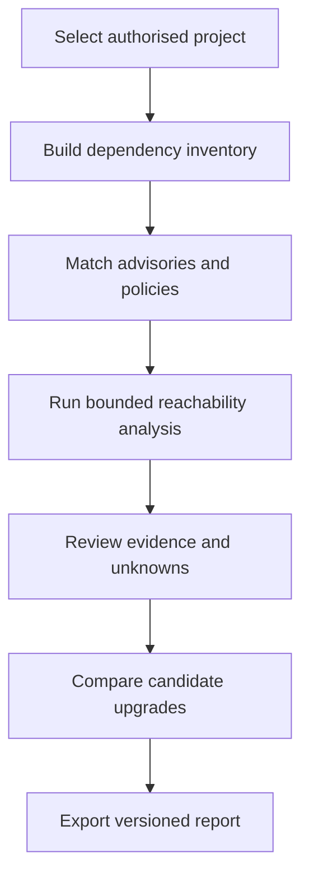

# Fides

Start the local prototype with `npm run dev` and open http://127.0.0.1:3000.
Opening frontend/index.html directly cannot run the analysis engine.
Scan & Scope includes a ready-to-run demo, downloadable sample lockfile/source,
and file import. Settings includes dark/light/system themes, contrast, page size
and report retention. Imports use the bundled synthetic advisory snapshot.

Fides is our MUJHackX 4.0 solution for Cybersecurity PS12: Software Supply Chain Dependency Risk Analyser.

It helps a developer answer three questions before shipping:

1. Which installed dependencies have known or policy-relevant risks?
2. What evidence shows whether the application may use the affected code?
3. Which candidate dependency change is safest under the checks we actually ran?

The initial target is a local CLI and local web report for small npm projects using `package-lock.json` v2 or v3 and JavaScript source. It will not claim universal exploitability analysis, malware detection, legal advice, or guaranteed secure releases.

## Product principles

- Evidence before scores.
- Unknown is a valid result.
- Static scanning never executes the target repository.
- Package presence, version applicability, code reachability and exploitability are separate claims.
- A passing test means only that the named test passed in the recorded environment.
- Every recommendation must be reproducible from versioned inputs.
- Core PS requirements come before extra AI or visual features.

## Planned workflow

## Documentation

| File | Purpose |
| --- | --- |
| [SCOPE.md](SCOPE.md) | Supported boundary, exclusions and PS coverage |
| [FEATURES.md](FEATURES.md) | Feature behaviour and acceptance conditions |
| [ARCHITECTURE.md](ARCHITECTURE.md) | Components, data flow and trust boundaries |
| [SECURITY.md](SECURITY.md) | Threat model, controls and disclosure policy |
| [PLAN_VALIDATE.md](PLAN_VALIDATE.md) | Validation-first execution plan and gates |
| [TESTING.md](TESTING.md) | Test suites, fixtures and release gates |
| [DATA_EVIDENCE.md](DATA_EVIDENCE.md) | Evidence sources, provenance and advisory curation |
| [API_CONTRACTS.md](API_CONTRACTS.md) | Initial internal data and service contracts |
| [UI_SPEC.md](UI_SPEC.md) | Report pages, information hierarchy and states |
| [ROADMAP.md](ROADMAP.md) | Two-person 36-hour schedule and ownership |
| [DEMO.md](DEMO.md) | Honest judge demonstration and fallback plan |
| [DECISIONS.md](DECISIONS.md) | Important product and engineering decisions |
| [CONTRIBUTING.md](CONTRIBUTING.md) | Branch, review and change rules |
| [AGENTS.md](AGENTS.md) | Mandatory instructions for Codex and coding agents |
| [GLOSSARY.md](GLOSSARY.md) | Precise terminology used across the project |
| [SOURCES.md](SOURCES.md) | Primary references and competitor baselines |

## Prototype stack

- TypeScript modules for inventory, advisory matching, bounded reachability,
  policy, planning and orchestration.
- A dependency-free local Node HTTP server and browser interface.
- Babel parser/traverse for JavaScript syntax processing without executing the
  selected project.
- Versioned JSON audit exports. The hackathon fixture uses a clearly labelled,
  dated synthetic advisory snapshot rather than a live OSV request.

## Current state

Status: a local hackathon prototype scans the included team-owned fixture,
builds exact npm package instances, matches a bundled advisory snapshot, emits
bounded reachability results, compares snapshot candidates and downloads a
complete audit record. It is not a production scanner, benchmark, security
audit or accuracy claim.

Use `npm run build`, `npm run typecheck`, `npm test`, and `npm run dev`. Open
`http://127.0.0.1:3000`, select **Run deterministic scan**, then follow the five
workflow pages. The scanner reads its fixture as bounded text and does not run
target code or lifecycle scripts. See [FINAL_VALIDATION.md](FINAL_VALIDATION.md)
for reproduced results and known limits.

## Problem-statement coverage

The design addresses dependency resolution, known vulnerabilities, bounded reachability, outdated dependencies, suspicious changes, licence conflicts, concentration risk and the bonus remediation planner. The initial npm-only boundary must be disclosed because the problem statement refers to project ecosystems more broadly.

## References

See [SOURCES.md](SOURCES.md).
